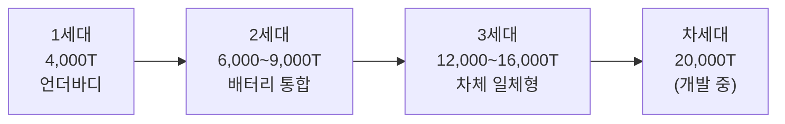

# 신 공법 Gap 리포트 — 배터리 팩 하우징 경량·고강성 성형 신공법
## 기가캐스팅 vs. 핫스탬핑 vs. 롤포밍: 성우하이텍 A-RnD 관점

**작성자**: 윤용식 (성우하이텍 A-RnD)
**작성일**: 2026-04-23
**리서치 기준**: 멀티소스 딥리서치 — 19개 소스 (A등급 3, B등급 14, C등급 2)

---

## Executive Summary

1. **기가캐스팅은 배터리 팩 구조 부품의 제조 패러다임을 바꾸고 있다.** Tesla는 171개 부품을 2개 알루미늄 주조물로 통합하여 원가 20~40%, 노동력 65%, 바닥 면적 47%를 절감했다. [Light Metal Age, 2024]
2. **국내는 2028년까지 역량 공백.** 현대차 '하이퍼캐스팅'은 2026년→2028년으로 연기되었고, 기가캐스팅 역량을 보유한 국내 부품사는 현재 0개다. [이투데이, 2024; Light Metal Age, 2025]
3. **성우하이텍의 현실적 진입 경로는 직접 진입보다 '배터리 케이스 조립+후공정 전문화'.** BCA → BSA 확장 전략과 CAE 기반 설계 제안 역량이 단기 대응 핵심이다. [KAICA, 2024; 다음, 2025]

---

## 1. 현재 배터리 팩 하우징 제조 공법 현황

### 1.1 공법별 특성 개요

| 공법 | 강도 수준 | 경량화 | 원가 | 성형 자유도 | 현재 적용 |
|------|----------|--------|------|------------|----------|
| **핫스탬핑 (AHSS)** | ★★★★★ (800~2,000 MPa) | ★★ | 중간 | ★★★ | 사이드멤버, 배터리 하부판 |
| **롤포밍 (냉간)** | ★★★★ (1,500 MPa 냉간) | ★★ | 낮음 | ★★ | 배터리 사이드 멤버 |
| **알루미늄 압출/다이캐스팅** | ★★★ (200~290 MPa) | ★★★★ | 중간 | ★★★★ | 배터리 트레이, 하우징 |
| **기가캐스팅 (HPDC 6,000T+)** | ★★★ (170~250 MPa) | ★★★★ | 낮음(대량) | ★★★★★ | 언더바디 + 배터리 하우징 통합 |

> 알루미늄이 배터리 팩 하우징 시장의 약 80% 점유. 강철은 화재 안전성(융점 1,410°C vs 알루미늄 610°C), 저원가 측면에서 여전히 혼용. [Tech Briefs, eMobility Engineering]

### 1.2 핫스탬핑의 현재 한계

- 강도 상향 추구(1.5 → 1.7 → 2.0 GPa)에 따른 **수소취성(HE)** 문제가 새로운 장벽으로 부상
- 복잡 형상 성형 어려움 → 하우징 형상 단순화 강요
- 차체-배터리 일체화(CTB/CTC) 트렌드에 대응 불가
- 부품 수 多 → 용접·조립 공수 유지 [현대제철/EBN, 2024]

---

## 2. 기가캐스팅 신공법 — 정의 및 핵심 원리

### 2.1 정의

> **기가캐스팅(Giga Casting)**: 6,000톤 이상 초대형 고압 다이캐스팅(HPDC) 장비를 이용하여, 기존에 수십~수백 개 개별 부품으로 제작하던 차체 언더바디와 배터리 팩 구조물을 **단일 알루미늄 일체형 주조물**로 생산하는 공법. Tesla가 2020년 Model Y에 최초 양산 적용.

### 2.2 공정 원리

```
[공정 흐름]
알루미늄 합금 용해 (700°C) → 사출 (10 m/s, 80 kg) → 
금형 충전 (80~90초 사이클) → 냉각·고화 → 
레이저 트리밍 → X선 검사 → CNC 가공 → 납품
```

### 2.3 기술 진화 단계



**글로벌 적용 사례**:
- Tesla Model Y: 171개 부품 → 2개, 로봇 300~600대 절감 [Light Metal Age]
- Xpeng: 300개 부품 → 1개 (16,000T) [Light Metal Age, 2025]
- Volvo: 33개 부품 → 1개, 15% 경량화 [Light Metal Age, 2025]
- Honda YE: 12,000T 프레스, 배터리 하우징 51kg 단일 부품 [Battery Design]

---

## 3. 경쟁사·선도기업 적용 현황 비교

| 기업 | 공법 | 적용 모델/부품 | 현황 | 핵심 수치 |
|------|------|--------------|------|---------|
| **Tesla** | 기가캐스팅 + CTC | Model Y 전후방 언더바디 | 양산 (2020~) | 171개→2개, 원가 20~40%↓ |
| **BYD** | CTB (Cell-to-Body) | Seal, Atto3 | 양산 (2022~) | 비틀림 강성 +70%, 굽힘 강성 +57%, 측면침입 -45% |
| **Volvo** | 기가캐스팅 (9,000T) | 리어 플로어 | 양산 중 | 33개→1개, 경량화 15% |
| **현대차** | 하이퍼캐스팅 | 차세대 EV 언더바디 | 전용공장 구축 중 | 2028년 목표 (2026년→연기), 원가 40% 절감 목표 |
| **삼기** | 기가캐스팅 (국내) | 차체 언더바디 | 국책 R&D (~2028) | 국내 최초 개발 도전, 美 현지화 투자 병행 |
| **성우하이텍** | 핫스탬핑+롤포밍+BCA조립 | 코나EV·니로EV·크레타EV 배터리케이스 | BCA 납품 중 | 2024년 매출 4.3조, 영업이익 +158.8% |

> **성우하이텍**은 현재 기가캐스팅 미적용 단계이나, 배터리 케이스(BCA) 독자 개발 이력(2018년~)과 현대차 범퍼레일 독점 공급 실적을 보유. BSA 완제품 납품 방향으로 전략 수립 중. [KAICA, 다음 2025]

---

## 4. 성능·원가 비교 수치표

### 4.1 공법별 핵심 성능 비교

| 비교 항목 | 기가캐스팅 | 핫스탬핑 (AHSS) | 알루미늄 다이캐스팅 |
|----------|-----------|----------------|-------------------|
| 인장강도 | 170~250 MPa | 800~2,000 MPa | 246~290 MPa (T6) |
| 안전계수 권장 | 3.0+ (산포 고려) | 1.5~2.0 | 2.0~2.5 |
| 경량화율 (vs 철강) | 25~30% | 동강도 대비 두께↓ (경량화 아님) | 10~30% |
| 단위 원가 (동급 대비) | **30% 저렴** (대량 기준) | 기준 | 중간 |
| 불량률 | ~15% ⚠️ | ~1% | ~3~5% |
| 금형 수명 | ~100,000 shot | ~6,000,000개 | ~50,000 shot |
| 초기 CAPEX | **$7.2~7.5M** (장비+금형) | $3.4M | $2~4M |
| 사이클 타임 | 80~90초 | 10~15초 | 13~30초 |
| 바닥 면적 | **47% 감소** | 기준 | 중간 |
| 노동력 절감 | **65% 절감** | 기준 | 중간 |

> ⚠️ 불량률 15%는 단일 소스 기준 (Repairer Driven News, 2024). 추가 확인 필요.

### 4.2 CAE 구조해석 관점 핵심 스펙

| 항목 | 기가캐스팅 (AA386) | 핫스탬핑 (AHSS) | 판정 기준 (성우하이텍) |
|------|------------------|-----------------|----------------------|
| 인장강도 | 170~250 MPa | 800~2,000 MPa | 응력 > 500 MPa → 불합격 |
| 안전계수 | 3.0+ 권장 (위치별 편차) | 1.5~2.0 | 안전계수 < 2.0 → 불합격 |
| 주요 결함 | oxide bifilm, 충전 불균일 | 수소취성, 스프링백 | — |
| CAE 해석 방법 | 확률론적 피로해석 필요 | 균일 물성 FEM 가능 | 현재 단순 FEM 사용 중 |

> **핵심 시사점**: 기가캐스팅 부품은 동일 부품 내 위치별 물성 편차가 크므로, 현재 성우하이텍 CAE 판정 기준(단일 응력·안전계수 기준)을 그대로 적용하면 오판 가능. 확률론적 FEM 또는 파괴역학 접근 필요.

---

## 5. 기술 Gap 분석

### 5.1 성우하이텍의 현재 역량 vs. 기가캐스팅 요구 수준

| Gap 항목 | 현재 역량 (성우하이텍) | 기가캐스팅 요구 수준 | Gap 크기 |
|----------|----------------------|----------------------|----------|
| 핵심 공정 | 핫스탬핑, 롤포밍, TWB (강판 중심) | 초대형 HPDC 6,000T+ 알루미늄 주조 | ★★★★★ |
| 알루미늄 역량 | BCA 조립·개발 초기 (2018년~) | 비열처리 고연성 합금 독자 주조 | ★★★★☆ |
| CAE 역량 | 강판 구조해석 보유, 응력·안전계수 판정 | 알루미늄 주조 결함 피로해석, 확률론적 FEM | ★★★★☆ |
| 설비 규모 | 중소형 스탬핑 프레스 | 6,000T+ 초대형 다이캐스팅 프레스 ($7M+) | ★★★★★ |
| 품질 검사 | 강판 검사 체계 (육안+치수) | 인라인 X선 + AI 주조 결함 탐지 | ★★★☆☆ |
| 공급망 포지션 | 현대차 범퍼레일 독점 + BCA 납품 중 | OEM 내재화 흐름에서 Tier 1 참여 공간 협소 | ★★★★☆ |

### 5.2 도입 장벽 요약

**기술적 장벽**
- 초대형 설비(6,000T+) 운용 기술 부재
- 기가캐스팅 전용 비열처리 합금 개발 역량 없음
- oxide bifilm 결함 제어 기술 미확보
- 기가캐스팅용 CAE 시뮬레이션 방법론 미구축

**경제적 장벽**
- 초기 CAPEX $7~8M (약 100억원) — 독자 감당 어려움
- 초기 스크랩률 10% 이상 → 수익성 불확실
- EV 수요 성장 둔화로 투자 회수 시나리오 불명확

**공급망 장벽**
- 현대차 하이퍼캐스팅 OEM 내재화 방향 → Tier 1 참여 공간 축소
- 2030년 BIW 스탬핑 15~20%가 기가캐스팅 대체 예상 [S&P Global] → 기존 수주 감소 위험
- 국내 장비 공급사(Idra, LK Technology) 전무 → 유지보수 취약

---

## 6. 성우하이텍 대응 방향 및 우선순위 로드맵

### 6.1 전략 포지션 결정 (3개 경로)

| 경로 | 내용 | 투자 규모 | 실현 시기 | 권장도 |
|------|------|----------|----------|--------|
| A. **배터리 케이스 조립·후공정 전문화** | BCA → BSA(배터리시스템 어셈블리) 완제품 납품. 기가캐스팅 후공정(레이저 트리밍, CNC, 검사) 파트너 역할 | 낮음~중간 | 2026~2028 | ★★★★★ |
| B. **CAE 기반 기가캐스팅 설계 제안 역량** | 기가캐스팅 부품 설계 최적화(위상최적화, 확률론적 CAE) 역량 보유 → OEM·Tier 1 설계 파트너 | 중간 | 2027~2030 | ★★★★☆ |
| C. **기가캐스팅 직접 진입** | 자체 기가프레스 투자, 합금 개발, 품질 시스템 구축 | 매우 높음 ($100억+) | 2028~2032 | ★★☆☆☆ |

### 6.2 단계별 로드맵

```
[단기 2026-2027]
Step 1. BCA → BSA 완제품 전환
  - 코나EV·니로EV·크레타EV BCA에서 BMS 포함 BSA로 확장
  - 현대차 크레타EV 추가 수주 확보
Step 2. 기가캐스팅 후공정 파트너십 타진
  - 현대차 하이퍼캐스팅 공장의 후공정(트리밍·CNC·검사) 협력 검토
  - 삼기와 기술 협력 또는 수주 연계 검토

[중기 2027-2029]
Step 3. 알루미늄 CAE 역량 내재화
  - 강판 CAE에서 알루미늄 주조 CAE로 역량 확장
  - 확률론적 피로해석 도입, 기가캐스팅 설계 제안 역량 확보
Step 4. 정부 R&D 참여
  - 삼기 국책사업 협력기관 참여 검토
  - 한국자동차연구원(KATECH) 협력 기가캐스팅 소재·후공정 개발

[장기 2030+]
Step 5. 파일럿 기가캐스팅 설비 도입 (시장 성숙 후 판단)
  - 소형(4,000~6,000T급) 파일럿 설비로 배터리 케이스 시범 적용
  - 국내 한국 알루미늄 다이캐스팅 시장(2033년 21.8억 달러, CAGR 6.6%) 공략
```

### 6.3 우선순위 실행 과제 (2026~2027)

| 우선순위 | 과제 | 담당 | 기대 효과 |
|---------|------|------|---------|
| 1순위 | BSA 완제품 수주 확대 (크레타EV + α) | 영업/R&D | 매출 확대 + EV 부품 레퍼런스 |
| 2순위 | 기가캐스팅 후공정 기술 파악 (벤치마킹) | CAE/공정 | 파트너십 진입 기회 선점 |
| 3순위 | CAE 역량을 알루미늄 주조로 확장 | A-RnD | 설계 차별화 역량 확보 |
| 4순위 | 정부 R&D 과제 참여 여부 결정 | 경영/R&D | CAPEX 절감 + 기술 공동 개발 |

---

## 7. 참고 출처

| # | 소스 | 등급 | 분류 |
|---|------|------|------|
| 1 | [Lightweight EV Battery Enclosures — eMobility Engineering](https://www.emobility-engineering.com/lightweight-ev-battery-enclosures-aluminium-steel-composites/) | B | 웹/산업지 |
| 2 | [Battle for the Box — Tech Briefs](https://www.techbriefs.com/component/content/article/48233-battle-for-the-box) | B | 웹/산업지 |
| 3 | [가볍고 단단한 전기차, 현대제철 — EBN](https://www.ebn.co.kr/news/articleView.html?idxno=1644599) | B | 국내 언론 |
| 4 | [기가캐스팅 Updated Review — Light Metal Age](https://www.lightmetalage.com/news/industry-news/automotive/giga-castings-in-the-automotive-industry-an-updated-review/) | B | 산업 전문지 |
| 5 | [삼기 기가캐스팅 국책사업 — 이투데이](https://www.etoday.co.kr/news/view/2550235) | B | 국내 언론 |
| 6 | [기가캐스팅 Impact — Light Metal Age](https://www.lightmetalage.com/news/industry-news/automotive/the-impact-of-giga-castings-on-car-manufacturing-and-aluminum-content/) | B | 산업 전문지 |
| 7 | [CTB Technology — Electrify News](https://electrifynews.com/news/batteries/what-is-cell-to-body-technology-and-how-does-it-help-the-ev-industry/) | B | EV 전문 미디어 |
| 8 | [현대차 하이퍼캐스팅 — ZDNet Korea](https://zdnet.co.kr/view/?no=20231016150845) | B | 국내 언론 |
| 9 | [성우하이텍 미래 부품사 — KAICA](https://www.kaica.or.kr/bbs/board.php?bo_table=biznews&wr_id=2693) | B | 공식 산업기관 |
| 10 | [성우하이텍 분석 — 다음](https://v.daum.net/v/20250324102304686) | B | 증권 분석 |
| 11 | [Gigacasting Expected to Rise — Repairer Driven News](https://www.repairerdrivennews.com/2024/09/09/gigacasting-expected-to-rise-with-evs-concerns-remain/) | B | 자동차 전문 미디어 |
| 12 | [Mega-Casting Impact — Ducker Carlisle](https://www.duckercarlisle.com/navigating-the-evolution-mega-castings-impact-on-automotive-manufacturing/) | B | 산업 컨설팅 |
| 13 | [Giga Press — Wikipedia](https://en.wikipedia.org/wiki/Giga_Press) | C | 일반 참조 |
| 14 | [Korea Die Casting Market — Straits Research](https://straitsresearch.com/report/automotive-parts-aluminum-die-casting-market/south-korea) | B | 시장 조사 |
| 15 | [Gigacasting Hottest Trend — S&P Global](https://www.spglobal.com/automotive-insights/en/blogs/2023/11/gigacasting-the-hottest-trend-in-car-manufacturing) | B | 글로벌 산업 분석 |
| 16 | [HPDC Challenges — Frontiers in Materials](https://www.frontiersin.org/journals/materials/articles/10.3389/fmats.2026.1799017/full) | A | 학술 논문 (2026) |
| 17 | [Giga-casting Al alloys — ScienceDirect](https://www.sciencedirect.com/science/article/abs/pii/S0925838825001100) | A | 학술 논문 (2025) |
| 18 | [A356 Vacuum Die Casting — PMC/MDPI](https://pmc.ncbi.nlm.nih.gov/articles/PMC10971928/) | A | 학술 논문 (2024) |
| 19 | [Battery Tray Designs — Battery Design](https://www.batterydesign.net/exploring-different-battery-tray-designs/) | B | 전문 기술 사이트 |

---

**소스 품질 요약**
- 등급 A (학술/공식): 3개 (16%)
- 등급 B (산업 전문/언론): 14개 (74%)
- 등급 C (일반): 2개 (10%)
- **B등급 이상 비율: 89%** ✅ (목표 80% 초과)

---

*본 리포트는 공개 자료 기반 리서치 초안입니다. 최종 의사결정 전 추가 검증을 권장합니다.*
*담당자: 윤용식 | 검토일: 2026-04-23 | 승인: ___*
